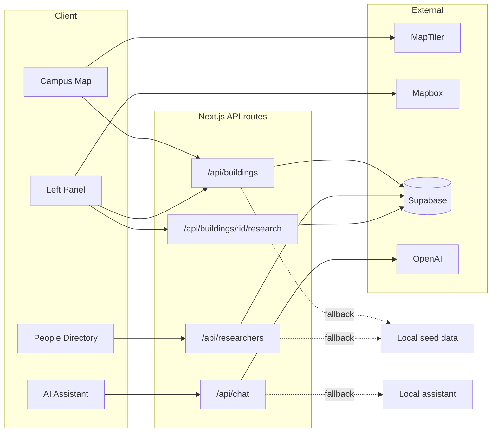

# UAPB Campus Research Map

An interactive campus map for the **University of Arkansas at Pine Bluff (UAPB)**. Explore buildings, view research activity, get walking/driving directions, browse faculty profiles, and ask questions with the built-in AI assistant.

## Features

- **Interactive map** — MapLibre + MapTiler basemap with satellite campus overlay and building pins
- **Building explorer** — Search, select buildings, and view photos, research projects, and researchers
- **Directions** — Walk or drive between buildings (Mapbox Directions API)
- **People directory** — Faculty profiles at `/directory` with photos, bios, and publications
- **AI assistant** — Campus-aware chat (OpenAI when configured; local fallback otherwise)
- **Deep links** — Share a building via `/?building=<id>` or a profile via `/directory?person=<id>`

## Tech stack

| Layer | Tools |
|--------|--------|
| App | [Next.js 16](https://nextjs.org) (App Router), React 19, TypeScript |
| Styling | Tailwind CSS 4 |
| Map | [MapLibre GL](https://maplibre.org), [@turf/turf](https://turfjs.org) |
| Data | Supabase (optional) + local seed fallbacks |
| AI | OpenAI API (optional) |

## Quick start

### Prerequisites

- [Node.js](https://nodejs.org) 20+
- [pnpm](https://pnpm.io) 11+

### 1. Install

```bash
git clone https://github.com/Timeless-Dave/uapb-campus-research-map.git
cd uapb-campus-research-map
pnpm install
```

### 2. Environment

Copy the example file and add your keys:

```bash
cp .env.example .env.local
```

| Variable | Required | Purpose |
|----------|----------|---------|
| `NEXT_PUBLIC_MAPTILER_KEY` | Yes (for map) | Basemap and satellite tiles |
| `NEXT_PUBLIC_MAPBOX_TOKEN` | For directions | Walking/driving routes |
| `NEXT_PUBLIC_SUPABASE_URL` | Optional | Live building & researcher data |
| `NEXT_PUBLIC_SUPABASE_ANON_KEY` | Optional | Supabase public client |
| `OPENAI_API_KEY` | Optional | Full AI chat responses |

The app runs without Supabase or OpenAI — it falls back to bundled seed data and a local assistant.

### 3. Run

```bash
pnpm dev
```

Open [http://localhost:3000](http://localhost:3000).

### 4. Production build

```bash
pnpm build
pnpm start
```

## How it works



1. **Map page (`/`)** loads buildings from `/api/buildings`, renders pins from `public/buildings.geojson`, and shows detail in the left sidebar.
2. **Supabase** is tried first; if unavailable or unset, APIs serve data from `src/lib/buildings-seed.ts` and `src/lib/research-seed.ts`.
3. **Directions** call Mapbox from the browser when `NEXT_PUBLIC_MAPBOX_TOKEN` is set.
4. **Chat** uses OpenAI on the server when `OPENAI_API_KEY` is set; otherwise replies come from campus seed data.

## Supabase setup (optional)

Apply migrations in order under `supabase/migrations/`:

```bash
# Using Supabase CLI (if linked to your project)
supabase db push
```

Or run the SQL files manually in the Supabase SQL editor:

1. `001_initial_schema.sql` — buildings, projects, researchers
2. `002_seed_stem_building_research.sql`
3. `003_researcher_profiles.sql` — profile fields (bio, photo, awards)
4. `004_seed_researcher_profiles.sql`
5. `005_building_images_and_larrison.sql`
6. `006_seed_evans_starling.sql`

## Project structure

```
src/
├── app/                    # Pages and API routes
│   ├── page.tsx            # Main map explorer
│   ├── directory/          # People directory
│   └── api/                # buildings, researchers, chat
├── components/
│   ├── map/                # CampusMap (MapLibre)
│   ├── layout/             # Sidebar, directions, header
│   ├── building/           # Photo gallery, map embeds
│   ├── directory/          # Profile cards and modal
│   └── ai/                 # Floating assistant
├── lib/                    # Seeds, directions, Supabase helpers
└── types/                  # Shared TypeScript types

public/
├── buildings.geojson       # Building footprints for map pins
├── buildings/              # Normalized building photos
└── researchers/            # Faculty headshots

supabase/migrations/        # Database schema and seeds
```

## Scripts

| Command | Description |
|---------|-------------|
| `pnpm dev` | Start dev server |
| `pnpm build` | Production build |
| `pnpm start` | Run production server |
| `pnpm lint` | Run ESLint |

## Security

- **Never commit** `.env`, `.env.local`, or real API keys.
- Use `.env.example` as the template; keep secrets in `.env.local` only.
- `OPENAI_API_KEY` is server-side only (no `NEXT_PUBLIC_` prefix).

## License

Private — University of Arkansas at Pine Bluff campus research project.
